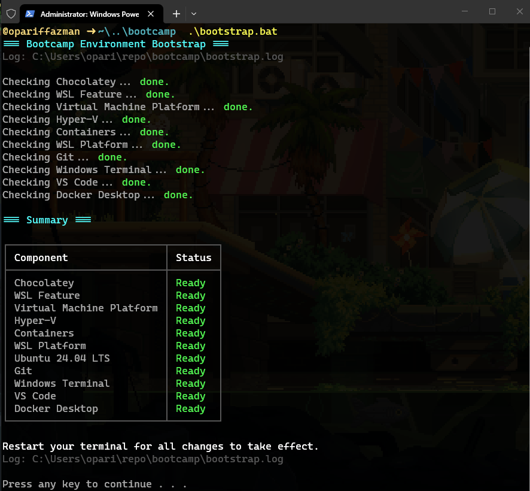

# bootstrap-devops-bootcamp

Bootstrap Windows for DevOps Bootcamp. One double-click. Auto-elevates.

## Usage

1. Download ZIP & extract in your desktop.
2. Double-click `script.bat`. Accept UAC prompt.
3. Wait. Reboot if prompted. Re-run script.
4. Pick `Y` to install Ubuntu 24.04 when asked.

Log written to `script.log` next to script.

## What it installs

- Chocolatey
- Windows features: WSL, Virtual Machine Platform, Hyper-V, Containers
- WSL Platform + Ubuntu 24.04 LTS
- Git, Windows Terminal, VS Code, Docker Desktop

Idempotent. Skips anything already present.

## Output

