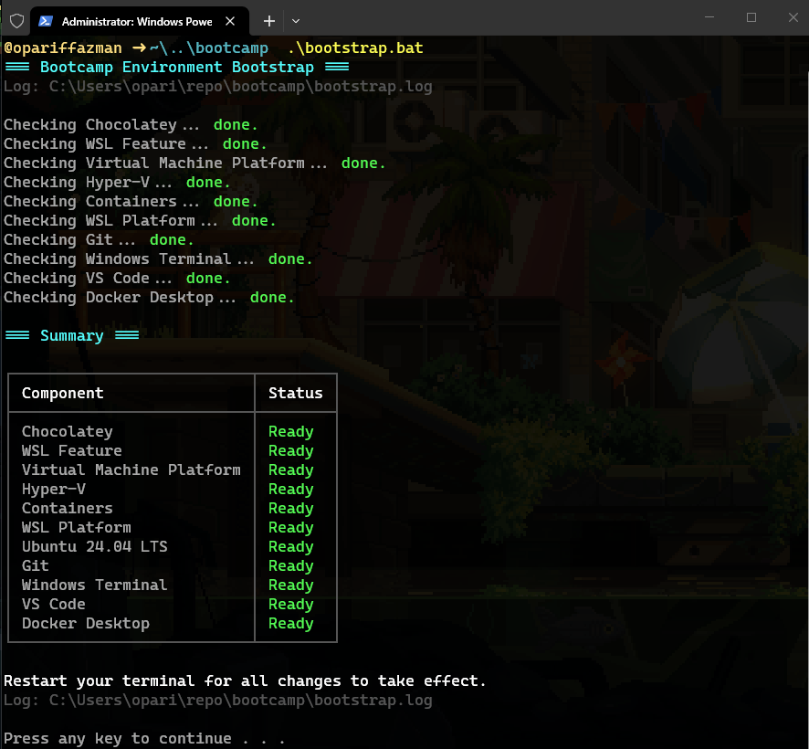
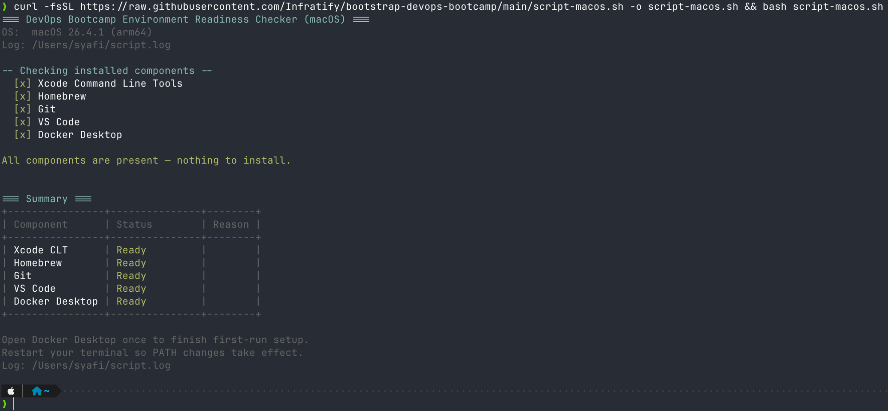
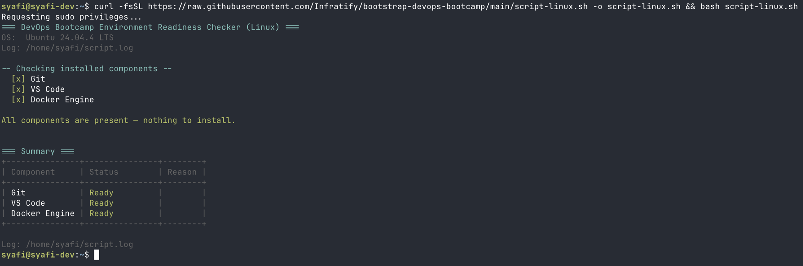

# DevOps Bootcamp Bootstrap

> One command. One coffee. A dev environment ready for the bootcamp.

Sets up your machine for the **DevOps Bootcamp** in a single command.

You get **Git**, **VS Code**, and **Docker** on every platform. On Windows you
also get **Ubuntu on WSL**, so you have a Linux shell like everyone else.

| Platform | Command | Under the hood |
|---|---|---|
| **Windows** | `install.ps1` | PowerShell + Chocolatey |
| **macOS** | `script-macos.sh` | Bash + Homebrew |
| **Linux Desktop** | `script-linux.sh` | Bash + apt/dnf |

> [!TIP]
> **Safe to run twice.**
>
> The script checks what you already have and only installs what's missing.
> If it fails halfway, just run it again. Nothing gets duplicated or broken.

---

## Quick navigation

- [Before you start](#before-you-start)
- [Windows](#windows) · [macOS](#macos) · [Linux](#linux)
- [Check it worked](#check-it-worked)
- [If something goes wrong](#if-something-goes-wrong)

---

## Before you start

| What you need | Detail |
|---|---|
| **Time** | 15–45 minutes. Mostly downloading. |
| **Disk space** | ~6 GB. Docker is the big one. |
| **Internet** | Stable. About 2 GB of downloads. |
| **Your password** | UAC on Windows. `sudo` on Mac and Linux. |

---

## Windows

1. **Open PowerShell.** Press `Win`, type `PowerShell`, hit Enter. You don't
   need to run it as Administrator. The script asks for that itself.

2. **Paste this and press Enter:**

   ```powershell
   irm https://raw.githubusercontent.com/Infratify/bootstrap-devops-bootcamp/main/install.ps1 | iex
   ```

3. **Click Yes** on the User Account Control prompt. A **new window** opens.
   Watch that one from now on.

4. **Press Y** when it offers to install Ubuntu 26.04 LTS.

5. **Wait.** A spinner with a timer appears while Ubuntu downloads. It takes a
   few minutes. Leave the window open.

6. **Pick a username and password** for Ubuntu.

   > [!NOTE]
   > This is a **new** username and password, just for Ubuntu. It is not your
   > Windows login. Nothing appears on screen as you type the password. That's
   > normal.

7. **Reboot if it asks.** Windows can't switch on WSL or Hyper-V while it's
   running. After rebooting, run the same command again. It carries on where
   it stopped.

8. **Open Docker Desktop once.** It needs one manual launch to finish setting
   itself up.

9. **Open your Linux shell.** Start **Windows Terminal** from the Start menu.
   Click the small arrow next to the `+` tab button and pick **Ubuntu-26.04**.

   > [!TIP]
   > That entry appears on its own. You don't have to set anything up. It logs
   > you straight in as the Ubuntu user you created in step 6.

The script and its `script.log` land in `Desktop\bootcamp\`.

> [!TIP]
> **Prefer clicking to typing?** Download the
> [project ZIP](https://github.com/Infratify/bootstrap-devops-bootcamp/archive/refs/heads/main.zip),
> extract it, and double-click **`script.bat`**. Same result.

**You get:** Chocolatey · WSL · Virtual Machine Platform · Hyper-V · Containers ·
Ubuntu 26.04 LTS · Git · Windows Terminal · VS Code · Docker Desktop.

> [!IMPORTANT]
> Hyper-V and Containers need **Windows Pro, Enterprise, or Education**.
> On **Windows Home** they show as `Not Supported`. That's expected and fine.
> WSL and Docker Desktop are all the bootcamp needs.



---

## macOS

1. **Open Terminal.** Press `⌘` + `Space`, type `Terminal`, hit Enter.

2. **Paste this and press Enter:**

   ```bash
   curl -fsSL https://raw.githubusercontent.com/Infratify/bootstrap-devops-bootcamp/main/script-macos.sh -o script-macos.sh && bash script-macos.sh
   ```

3. **Answer the prompts.** The script lists what's missing. For each one it
   asks before installing. Press Enter to accept.

4. **Watch for a popup.** A macOS dialog appears for Xcode Command Line Tools.

   > [!WARNING]
   > **Click Install on that dialog.** The script waits for it to finish. If
   > you dismiss the popup, the script keeps waiting up to 30 minutes and then
   > gives up. If that happens, just run the script again.

5. **Open Docker Desktop once** when the script is done. It needs one manual
   launch to finish setting itself up.

**You get:** Xcode Command Line Tools · Homebrew · Git · VS Code · Docker Desktop.

> [!TIP]
> [iTerm2](https://iterm2.com/) is a nicer terminal than Apple's. Optional.



---

## Linux

Works on **Ubuntu, Debian, Fedora, RHEL, Rocky, and AlmaLinux**.
Other distros (Arch, openSUSE, Alpine) are reported as `Not Supported`.

1. **Open a terminal.**

2. **Paste this and press Enter:**

   ```bash
   curl -fsSL https://raw.githubusercontent.com/Infratify/bootstrap-devops-bootcamp/main/script-linux.sh -o script-linux.sh && bash script-linux.sh
   ```

3. **Type your password.** The script needs `sudo` and restarts itself with it.

4. **Answer the prompts.** The script lists what's missing. For each one it
   asks before installing. Press Enter to accept.

5. **Log out and log back in** at the end.

   > [!IMPORTANT]
   > This step matters. It lets you run `docker` without `sudo`. Skip it and
   > every Docker command will fail with a permission error.

**You get:** Git · VS Code · Docker Engine · Docker CLI · Docker Compose v2 ·
Buildx · containerd.

> [!NOTE]
> Docker is installed from Docker's official repository, following
> [docs.docker.com/engine/install](https://docs.docker.com/engine/install/).



---

## Check it worked

**Open a new terminal**, then run:

```bash
git --version
code --version
docker --version
docker compose version
```

Each should print a version number:

```
git version 2.45.1
1.95.3
Docker version 27.5.1, build ...
Docker Compose version v2.32.4
```

On Windows, check Ubuntu too:

```powershell
wsl -d Ubuntu-26.04 -- whoami
```

It should print the username you chose, not `root`.

> [!WARNING]
> Seeing **`command not found`**?
>
> - Close every terminal window and open a new one. PATH changes only apply to
>   new terminals.
> - On Linux, log out and back in.
> - Run the script again. It only fixes what's broken.

---

## If something goes wrong

1. **Read `script.log`.** It sits next to the script. The error is almost
   always at the bottom.
2. **Run the script again.** It only installs what's missing.
3. **Still stuck?** Open an
   [issue](https://github.com/Infratify/bootstrap-devops-bootcamp/issues) and
   attach `script.log`.

---

<sub>Made for **DevOps Bootcamp** students. Install steps follow each tool's official documentation.</sub>
